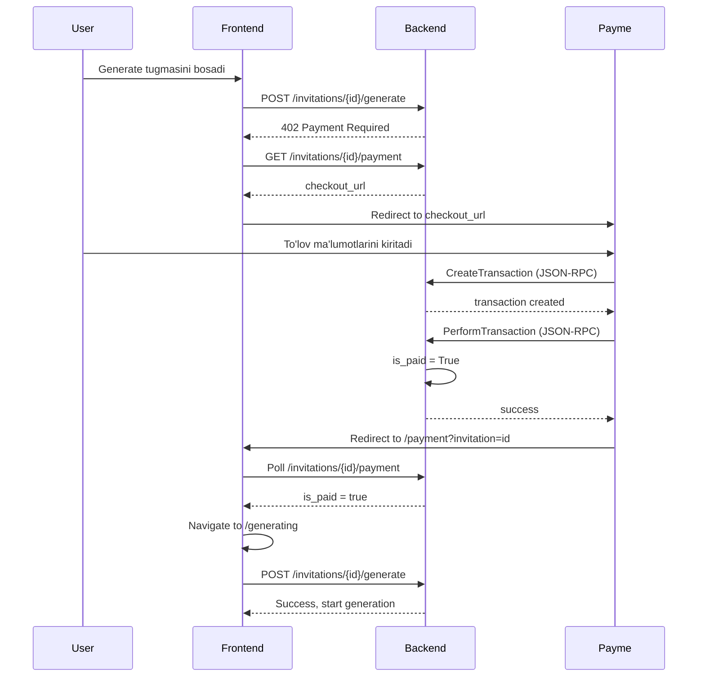

# Payme To'lov Integratsiyasi

## 📋 Umumiy Ko'rinish

Lutfan AI loyihasida Payme to'lov tizimi to'liq integratsiya qilingan. Foydalanuvchilar takliflarini yaratish uchun to'lov qilishlari kerak.

## 🏗️ Arxitektura

### Backend (Django)

**Fayllar:**
- `backend/apps/payments/views.py` - Payme Merchant API endpoint
- `backend/apps/payments/services.py` - To'lov logikasi va checkout link yaratish
- `backend/apps/payments/models.py` - PaymeTransaction modeli
- `backend/apps/payments/errors.py` - Payme xatolar

**API Endpoints:**

1. **GET `/api/v1/invitations/{id}/payment`**
   - To'lov ma'lumotlarini olish
   - Response:
     ```json
     {
       "invitation_id": "uuid",
       "is_paid": false,
       "amount_tiyin": 2000000,
       "amount_uzs": 20000,
       "checkout_url": "https://test.paycom.uz/bT02Nzd..."
     }
     ```

2. **POST `/api/v1/payments/payme/callback/`**
   - Payme Merchant API JSON-RPC endpoint
   - Methodlar:
     - `CheckPerformTransaction` - To'lovni tekshirish
     - `CreateTransaction` - Tranzaksiya yaratish
     - `PerformTransaction` - To'lovni tasdiqlash
     - `CancelTransaction` - To'lovni bekor qilish
     - `CheckTransaction` - Tranzaksiya holatini olish
     - `GetStatement` - Tranzaksiyalar ro'yxati

### Frontend (React)

**Fayllar:**
- `frontend/src/pages/CreateWizard.tsx` - Generate sahifasi (to'lov oqimini boshlaydi)
- `frontend/src/pages/PaymentPage.tsx` - To'lov kutish sahifasi
- `frontend/src/api/client.ts` - API client

**To'lov Oqimi:**



## 🔧 Sozlash

### 1. Environment Variables

**.env / .env.production:**
```bash
# Payme Test
PAYME_MERCHANT_ID=677d02e1dbc8d1a8dc0b77db
PAYME_KEY=5jswUzjhjwjUS4o#4Dhu6O?zGA@J%zNKNOxE
PAYME_TEST_MODE=true
INVITATION_PRICE_UZS=20000

# Production
# PAYME_KEY=ciOHjOjS6qWxXHu0HbC#8qTfNccg&Vjym&EA
# PAYME_TEST_MODE=false
```

### 2. Payme Business Cabinet Sozlamalari

**Test Cabinet:** https://test.paycom.uz/

1. Merchant ID: `677d02e1dbc8d1a8dc0b77db`
2. API Endpoint: `https://lutfanai.uz/api/v1/payments/payme/callback/`
3. Account Field: `order_id` (UUID format)
4. Test Key ni tasdiqlang

### 3. Callback URL Authentication

Payme har bir so'rovda Basic Auth yuboradi:
```
Authorization: Basic <base64(Paycom:PAYME_KEY)>
```

Backend bu autentifikatsiyani `_authorize()` funksiyasi orqali tekshiradi.

## 🧪 Test Qilish

### Test Karta
```
Card: 8600 4954 7331 6478
Expiry: 03/99
CVV: 666
SMS Code: 666666
```

### Manual Test Scenariyalari

**1. To'g'ri to'lov:**
```bash
# Yangi taklif yarating
# Generate bosing
# Payme checkout sahifasiga yo'naltirilasiz
# Test karta bilan to'lang
# Avtomatik /payment sahifasiga qaytadi
# To'lov tasdiqlanganidan keyin generatsiya boshlanadi
```

**2. To'lovni bekor qilish:**
```bash
# Payme checkout sahifasida "Bekor qilish" bosing
# /payment sahifasida qolasiz
# Polling davom etadi (to'lov kutilmoqda)
```

### Payme Test Sandbox

Payme Business cabinetda testlarni o'tkazish:

1. **Noto'g'ri summa:**
   - order_id: `{any-invitation-id}`
   - amount: `1000000` (noto'g'ri)
   - Kutilgan: Error -31001

2. **Allaqachon to'langan:**
   - order_id: `{paid-invitation-id}`
   - amount: `2000000`
   - Kutilgan: Error -31050

3. **Mavjud bo'lmagan order:**
   - order_id: `00000000-0000-0000-0000-000000000000`
   - amount: `2000000`
   - Kutilgan: Error -31050

## 🐛 Debugging

### Backend Logs

```bash
# Production
ssh avlo-gcp 'docker compose -f ~/lutfan_ai/docker-compose.prod.yml logs backend --tail=50'

# Local
python manage.py runserver
```

### Frontend Logs

Browser Developer Tools → Console

### Umumiy Muammolar

**1. 402 Payment Required davom etyapti**
```bash
# Qo'lda to'lovni tasdiqlash (test uchun)
ssh avlo-gcp 'docker compose -f ~/lutfan_ai/docker-compose.prod.yml exec -T backend python manage.py shell <<EOF
from apps.invitations.models import Invitation
from django.utils import timezone

inv = Invitation.objects.get(id="INVITATION_ID")
inv.is_paid = True
inv.paid_at = timezone.now()
inv.save()
print(f"Paid: {inv.is_paid}")
EOF'
```

**2. Payme Auth xatosi**
- Payme Business cabinetda Test Key to'g'ri ekanligini tekshiring
- Backend `.env` da `PAYME_KEY` to'g'ri ekanligini tekshiring

**3. Frontend eski build keshlangan**
```bash
# Browser keshni tozalash:
# Cmd+Shift+R (Mac) yoki Ctrl+Shift+R (Windows)

# Yoki Incognito/Private rejimda oching
```

## 📊 Monitoring

### To'lov Statistikasi

```bash
# Oxirgi 10 ta tranzaksiyani ko'rish
ssh avlo-gcp 'docker compose -f ~/lutfan_ai/docker-compose.prod.yml exec -T backend python manage.py shell <<EOF
from apps.payments.models import PaymeTransaction

txns = PaymeTransaction.objects.order_by("-created_at")[:10]
for txn in txns:
    print(f"{txn.id}: {txn.state} - {txn.amount/100} UZS")
EOF'
```

### To'lovli Takliflar

```bash
# To'lovli takliflar sonini ko'rish
ssh avlo-gcp 'docker compose -f ~/lutfan_ai/docker-compose.prod.yml exec -T backend python manage.py shell <<EOF
from apps.invitations.models import Invitation

paid = Invitation.objects.filter(is_paid=True).count()
unpaid = Invitation.objects.filter(is_paid=False).count()
print(f"Paid: {paid}, Unpaid: {unpaid}")
EOF'
```

## 🚀 Production Deployment

### 1. Production Key Almashtirish

`.env.production` faylida:
```bash
PAYME_KEY=ciOHjOjS6qWxXHu0HbC#8qTfNccg&Vjym&EA  # Real production key
PAYME_TEST_MODE=false
```

### 2. Payme Business cabinetda Production'ga o'tish

1. Test rejimidan chiqing
2. Production key ni tasdiqlang
3. Merchant statusini "Active" qiling

### 3. Backend'ni Restart Qilish

```bash
ssh avlo-gcp 'cd ~/lutfan_ai && docker compose -f docker-compose.prod.yml restart backend'
```

## 📝 Code Review Checklist

- [ ] Backend Merchant API barcha methodlarni qo'llab-quvvatlaydi
- [ ] Frontend to'lov oqimi to'g'ri ishlaydi
- [ ] Polling mexanizmi to'g'ri (3 sekund interval)
- [ ] Cache headerlari to'g'ri (index.html no-cache, assets cached)
- [ ] Error handling to'liq
- [ ] Test kartasi bilan to'lov ishlaydi
- [ ] Payme callback URL test.paycom.uz dan kiradi
- [ ] Production key xavfsiz saqlanadi (.env.production git'da yo'q)

## 🎯 Keyingi Qadamlar

1. ✅ Payme test.paycom.uz da barcha testlardan o'tish
2. ⏳ Payme'dan production key olish
3. ⏳ Production'da real to'lovlarni test qilish
4. ⏳ Analytics va monitoring qo'shish
5. ⏳ Email/SMS notification qo'shish (to'lov tasdiqlanganda)
